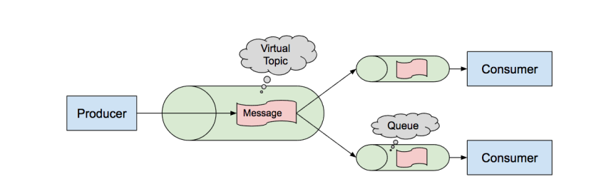

PRODUCER-SCALING-CONSUMER pattern

Producer emits events into a virtual topic.

Consumers receive events through their virtual queue.

Each event in virtual topic is processed only once by available Consumer.

using Virtual topic and virtual Queue

required (apache-activemq-5.17.1-bin): https://activemq.apache.org/components/classic/download/

