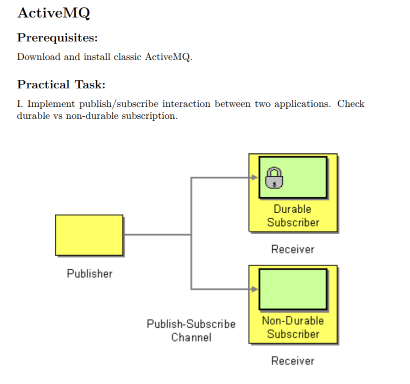

PUBLISHER SUBSCRIBER pattern

Publisher produces a topic.
Subscriber listen to topic.
Subscriber can be Durable/NonDurable
NB! for durable subscriber setting ClientId is required!!! (see in Subscriber prj)

NB! in this prj you can find simple queue example as well

